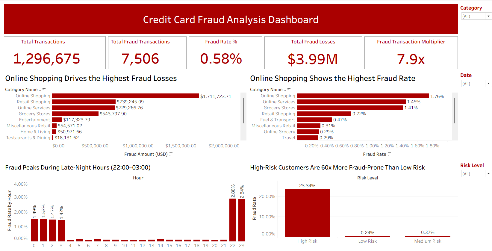
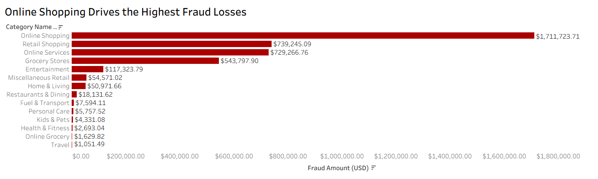
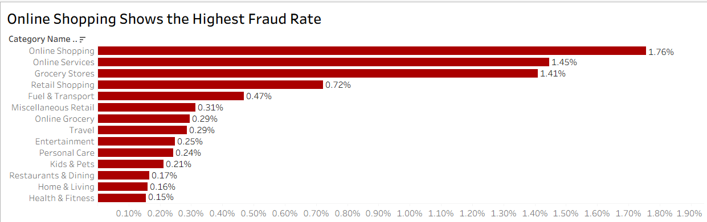
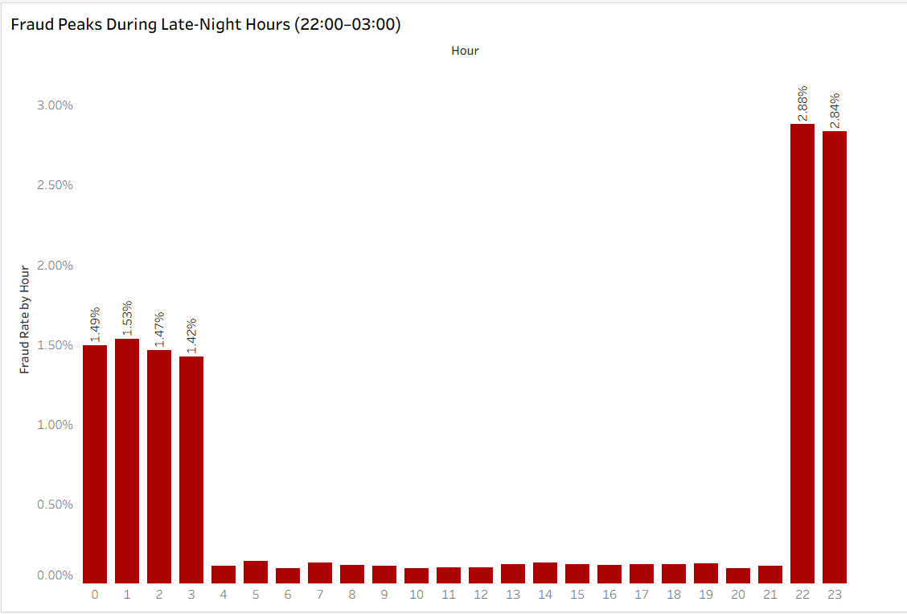
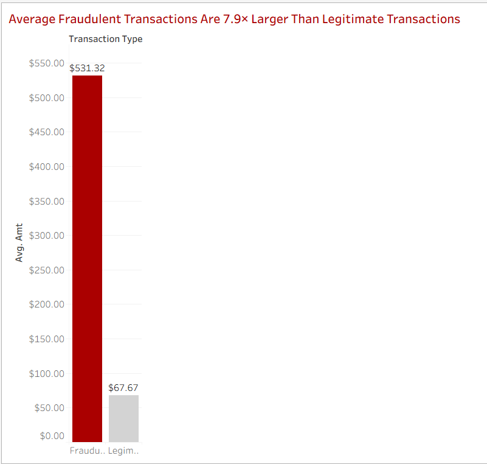

# Credit Card Fraud Analytics

### Risk Segmentation, Transaction Monitoring & Financial Loss Analysis

<p align="center">
  
</p>

<p align="center">


</p>

---

## Executive Summary

> [!IMPORTANT]
>
> **1.29 Million Transactions Analyzed**
>
> **7,506 Fraudulent Transactions Identified**
>
> **$3.99 Million in Fraud Losses**
>
> **Online Shopping Generated the Highest Fraud Exposure**
>
> **High-Risk Customers Showed a 23.34% Fraud Rate — ~63x Higher Than Low-Risk Customers**
>
> **Fraud Activity Peaked Between 22:00 and 03:00**

| Metric                            | Value                                                 |
| --------------------------------- | ----------------------------------------------------- |
| Total Transactions                | **1,296,675**                                         |
| Fraud Transactions                | **7,506**                                             |
| Fraud Rate                        | **0.58%**                                             |
| Total Fraud Losses                | **$3.99 Million**                                     |
| Highest Risk Category             | **Online Shopping**                                   |
| Peak Fraud Window                 | **22:00 – 03:00**                                     |
| High-Value Transaction Fraud Rate | **23.34%** (vs. **0.24%** for transactions under $50) |

---

## Contents

* [Live Dashboard](#live-dashboard)
* [Project Overview](#project-overview)
* [Dataset](#dataset)
* [Tools & Technologies](#tools--technologies)
* [Analytical Workflow](#analytical-workflow)
* [Executive Dashboard](#executive-dashboard)
* [Executive Findings](#executive-findings)
* [Business Recommendations](#business-recommendations)
* [Project Highlights](#project-highlights)
* [Repository Structure](#repository-structure)
* [Author](#author)

---

## Live Dashboard

### Tableau Public Dashboard

**View Interactive Dashboard**

https://public.tableau.com/app/profile/rahul.tanwar8538/viz/Credit_Card_Fraud_Analysis_17815948901510/Dashboard1

---

## Project Overview

Financial fraud remains one of the most significant challenges faced by banks, payment processors, and e-commerce platforms.

This project analyzes more than **1.29 million credit card transactions** to identify fraud patterns, quantify financial losses, uncover high-risk customer behavior, and develop actionable, data-derived recommendations for fraud risk reduction.

The project follows a complete analytics workflow:

**Python Exploratory Data Analysis → PostgreSQL Business Analysis → Tableau Dashboard Development**

The objective was to answer a fundamental business question:

> *Where does fraud occur, when does it occur, who is most vulnerable, and what specific controls would reduce exposure based on the patterns observed in this data?*

---

## Dataset

**Source:**
https://www.kaggle.com/datasets/kartik2112/fraud-detection

| Metric             | Value             |
| ------------------ | ----------------- |
| Records            | **1,296,675**     |
| Features           | **29**            |
| Fraud Transactions | **7,506**         |
| Fraud Rate         | **0.58%**         |
| Fraud Losses       | **$3.99 Million** |

---

## Tools & Technologies

| Tool           | Purpose                                   |
| -------------- | ----------------------------------------- |
| Python         | Data Cleaning & Exploratory Data Analysis |
| Pandas         | Data Manipulation                         |
| Matplotlib     | Data Visualization                        |
| PostgreSQL     | Business Analysis & Querying              |
| Tableau Public | Dashboard Development                     |
| GitHub         | Documentation & Version Control           |

---

## Analytical Workflow

### Stage 1 — Exploratory Data Analysis (Python)

The project began with Python-based exploratory analysis to understand fraud distribution, transaction behavior, customer characteristics, merchant categories, transaction timing patterns, and financial exposure.

**Key Activities**

* Data cleaning and validation
* Feature engineering (hour-of-day extraction, risk segment derivation, category grouping)
* Fraud pattern identification across time and category
* Statistical comparison of fraud vs. non-fraud transaction amounts
* Visualization of distribution and outlier patterns

The objective of this phase was to identify meaningful patterns and formulate hypotheses to validate in SQL.

---

### Stage 2 — Business Analysis (PostgreSQL)

Insights identified during exploratory analysis were validated and expanded through SQL.

**PostgreSQL was used to perform:**

* Fraud rate calculations by category and hour
* Merchant-level and category-level aggregation
* Financial impact assessment (total and average fraud loss)
* Risk segmentation by transaction value (Low Risk: under $50, Medium Risk: $50–$500, High Risk: over $500), revealing fraud concentration patterns by transaction size
* Time-based fraud trend analysis

This stage transformed exploratory findings into measurable, query-verifiable business metrics.

---

### Stage 3 — Executive Dashboard (Tableau)

The final stage involved developing an interactive dashboard for business stakeholders, focused on fraud exposure monitoring, category-level analysis, financial loss assessment, time-based activity, and risk segmentation.

#### Fraud Amount Multiplier — Methodology

Transactions are segmented by value into:

* Low Risk (under $50)
* Medium Risk ($50–$500)
* High Risk (over $500)

The multiplier is calculated as the ratio of the fraud rate in the High-Value tier to the fraud rate in the Low-Value tier:

**23.34% ÷ 0.37% ≈ 63x**

This shows that fraud is heavily concentrated in larger transactions rather than spread evenly across all transaction sizes, supporting value-based transaction monitoring over blanket controls.

---

## Executive Dashboard

<p align="center">
  
</p>

---

## Executive Findings

### 1. Online Shopping Generates the Highest Fraud Losses

Online shopping transactions generated approximately **$1.71 Million** in fraudulent losses — **43% of total fraud exposure** — representing the largest financial loss among all transaction categories.

<p align="center">
  
</p>

---

### 2. Online Shopping Also Exhibits the Highest Fraud Rate

At **1.76%**, Online Shopping's fraud rate is more than **triple** the average across all categories, indicating elevated exposure specific to digital commerce channels rather than transaction volume alone.

<p align="center">
  
</p>

---

### 3. Fraud Activity Concentrates During Late-Night Hours

Fraud incidence rises to **2.84–2.88%** between **22:00 and 03:00** — roughly **5x** the daytime baseline rate — suggesting elevated risk during low-supervision periods consistent with automated or bot-driven attack patterns.

<p align="center">
  
</p>

---

### 4. Fraud Risk Is Heavily Concentrated in High-Value Transactions

Transactions above **$500** show a **23.34% fraud rate** versus **0.24%** for transactions under **$50** — a **63x difference**.

This indicates fraud risk scales sharply with transaction size, making value-based transaction monitoring significantly more efficient than uniform controls applied across all transaction amounts.

<p align="center">
  
</p>

---

## Business Recommendations

Each recommendation below is tied directly to a finding from this analysis.

| Finding                                                                                                     | Recommendation                                                                                                                         |
| ----------------------------------------------------------------------------------------------------------- | -------------------------------------------------------------------------------------------------------------------------------------- |
| Online Shopping accounts for **43% of fraud losses** and the highest fraud rate (**1.76%**)                 | Apply step-up authentication (OTP/biometric) specifically on online/card-not-present transactions above a risk-adjusted threshold      |
| Fraud rate spikes **5x** between **22:00–03:00**                                                            | Introduce time-based risk scoring that increases transaction friction or triggers manual review during this window                     |
| High-Value transactions (**>$500**) show a **63x higher fraud rate** than Low-Value transactions (**<$50**) | Apply additional verification steps specifically for transactions above the $500 threshold, where fraud risk concentrates most heavily |
| Grocery Stores and Online Services also show elevated fraud rates (**1.41%** and **1.45%**)                 | Extend category-specific monitoring rules beyond Online Shopping to these secondary risk categories                                    |
| A small number of merchants account for a disproportionate share of fraud within each category              | Flag and prioritize manual review for the top 3 highest-fraud merchants identified per category                                        |

---

## Project Highlights

* Analyzed **1.29 Million** credit card transactions end-to-end using **Python, PostgreSQL, and Tableau**
* Identified **$3.99 Million** in fraudulent transaction exposure and isolated its primary drivers
* Built a value-based risk segmentation framework quantifying a **63x fraud rate differential**
* Ranked merchants within each category using **SQL Window Functions**
* Designed an interactive executive dashboard for fraud monitoring and decision-making
* Translated analytical findings into a prioritized, data-derived set of fraud control recommendations

---

## Repository Structure

```text
credit-card-fraud-analysis
│
├── images
│   ├── Dashboard_overview.png
│   ├── Fraud_amt_by_category.png
│   ├── Fraud_amt_multiplier.png
│   ├── Fraud_rate_by_category.png
│   └── Fraud_rate_by_hour.png
│
├── python_notebook
│   └── exploratory_data_analysis.ipynb
│
├── sql
│   └── fraud_analysis_queries.sql
│
├── tableau
│   └── Credit_Card_Fraud_Analysis.twb
│
└── README.md
```

---

## Author

**Rahul Tanwar**

* LinkedIn: https://www.linkedin.com/in/rahul-tanwar-b13439295
* Tableau Public: https://public.tableau.com/app/profile/rahul.tanwar8538

---

